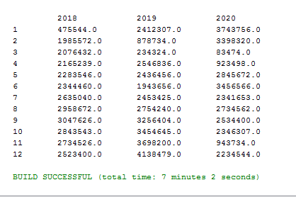

# Laporan Kuis Linked Lists

## Source Code
1. Source Code pada class Node

2. Source Code pada LinkedLists Class

3. Source Code pada Mian Class

4. Output

## Flowchart

Terdapat Flowchart Node Class, fungsi Node dan LinkedLists Class 

Terdapat Flowchart fungsi isEmpty, fungsi addFirst, fungsi add yang merupakan bagian dari LinkedLists Class

Terdapat flowchart Fungsi clear, fungsi print yang merupakan bagian dari LinkedLists Class

Terdapat flowchart Main class