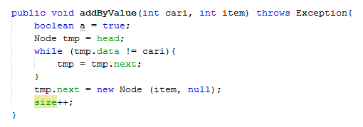

# Jawaban Pertanyaan Percobaan

1. Mengapa pada proses traverse nilai head perlu disimpan terlebih dahulu dalam variabel tmp ?
Transver adalah operasi yang digunakan untuk mencetak dam memproses penambahan data di akhir linked lists. Jadi fungsi head perlu disimpan di variabel tmp adalah agar ketika penambahan data baru head tidak berubah. Data yang baru akan menempati tmp saja dan head tetap berisi data.

2. Apa kekurangan implementasi single LinkedLists tanpa penunjuk tail ? 
Tidak akan bisa menambah data baru di belakang, karena perubahan data baru membutuhkan tail yang mengikat node baru. Secara singkatnya agar head tidak berubah atau bergeser.

3. Tambahkan implementasi method addByValue berdasarkan nilai yang dicari! Node baru akan ditambahkan setelah node yang dicari ditemukan.

Jawab :
Source code dalam LinkedLists Class

Source code dalam MainLinkedList Class

Ouput dari addByLinked

4. Tambahkan implementasi method removeByValue berdasarkan nilai yang dicari!

Jawab :
Source code dari LinkedList Class

Source code dari MainLinkedLists Class

Ouput dari source code tersebut 

5. Tambahkan menu serta submenu dan inputan dinamis (semua tipe data) pada program
percobaan tersebut !
Jawab :

package percobaan;
import java.util.Scanner;
/**
 *
 * @author Asus
 */
public class MainLinkedLists {
    public static void Menu() {

        System.out.println("====================================");
        System.out.println(" MENU ");
        System.out.println("1. Tambah");
        System.out.println("2. Hapus");
        System.out.println("3. Cari");
        System.out.println("4. Keluar");

        System.out.println("====================================");
    }

    public static void MenuAdd() {

        System.out.println("====================================");
        System.out.println(" MENU ");
        System.out.println("1. Tambah (First)");
        System.out.println("2. Tambah (Index)");
        System.out.println("3. Tambah (Last)");

        System.out.println("====================================");
    }

    public static void MenuHapus() {

        System.out.println("====================================");
        System.out.println(" MENU ");
        System.out.println("1. Hapus (Index)");
        System.out.println("2. Hapus (Key)");
        System.out.println("3.. Clear");

        System.out.println("====================================");
    }

    public static void MenuCari() {

        System.out.println("====================================");
        System.out.println(" MENU ");
        System.out.println("1. Cari (Index)");
        System.out.println("2. Cari (Key)");

        System.out.println("====================================");
    }
    public static void main(String[] args) {
        Scanner sc = new Scanner(System.in);
        int pilih, sub;
        int dt, idx;
        LinkedLists data = new LinkedLists();
        try {
            do {
                Menu();
                System.out.println("Masukkan Pilihan Anda : ");
                pilih = sc.nextInt();
                switch (pilih) {
                    case 1:
                        do {
                            MenuAdd();
                            System.out.println("Masukkan Pilihan Anda :");
                            sub = sc.nextInt();
                            switch (sub) {
                                case 1:
                                    System.out.println("Masukkan Data : ");
                                    dt = sc.nextInt();
                                    System.out.println("=======================");
                                    data.addFirst(dt);
                                    data.print();
                                    break;
                                case 2:
                                    System.out.println("Masukkan Data : ");
                                    dt = sc.nextInt();
                                    System.out.println("Masukkan Index : ");
                                    idx = sc.nextInt();

                                    System.out.println("=========================");
                                    data.add(dt, idx);
                                    data.print();
                                    break;
                                case 3:
                                    System.out.println("Masukkan Data : ");
                                    dt = sc.nextInt();
                                    data.addFirst(dt);
                                    data.print();
                                    break;
                                case 4:
                                    System.out.println("Masukkan Data : ");
                                    dt = sc.nextInt();
                                    data.addLast(dt);
                                    data.print();
                                    break;
                            }
                        } while (sub != 0);
                        break;
                    case 3:
                        do {
                            MenuCari();
                            System.out.println("Masukkan Pilihan Anda : ");
                            sub = sc.nextInt();
                            switch (sub) {
                                case 1:
                                    System.out.println("Masukkan Index : ");
                                    idx = sc.nextInt();
                                    data.remove(idx);
                                    data.print();
                                    break;
                                case 2:
                                    System.out.println("Masukkan Data : ");
                                    dt = sc.nextInt();
                                    data.removeFirst();
                                    data.print();
                                    break;
                            }
                        } while (sub != 0);
                        break;
                }
            } while (pilih != 0);
        } catch (Exception e){
            System.out.println(e.getMessage());
        }      
    }
}